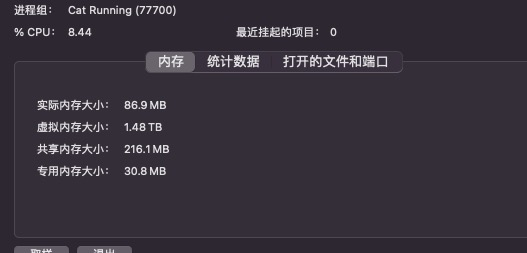

小工具只支持mac系统哦 😄

先看效果

​

图上的小猫咪会根据你自身电脑的cpu使用率变化而变化。

cpu使用率越高，小猫咪🏃跑的越慢～😂😂😂

这种可视化的效果让各位大佬更容易感知系统的运行状态。😄😄😄😄

以下为程序运行需要的内存：

​

貌似有点大。。。😂

显示小猫咪和cpu占用率的版本：链接:https://pan.baidu.com/s/1CTVyvY5TwGCqt_c1XqpTWw?pwd=bxjx 提取码:bxjx 复制这段内容后打开百度网盘手机App，操作更方便哦

只显示小猫咪的版本:链接: https://pan.baidu.com/s/16Yt0OtLYaFZYTDC4imT7hg?pwd=hqxr 提取码: hqxr 
--来自百度网盘超级会员v7的分享
